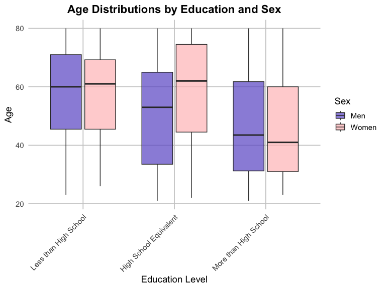
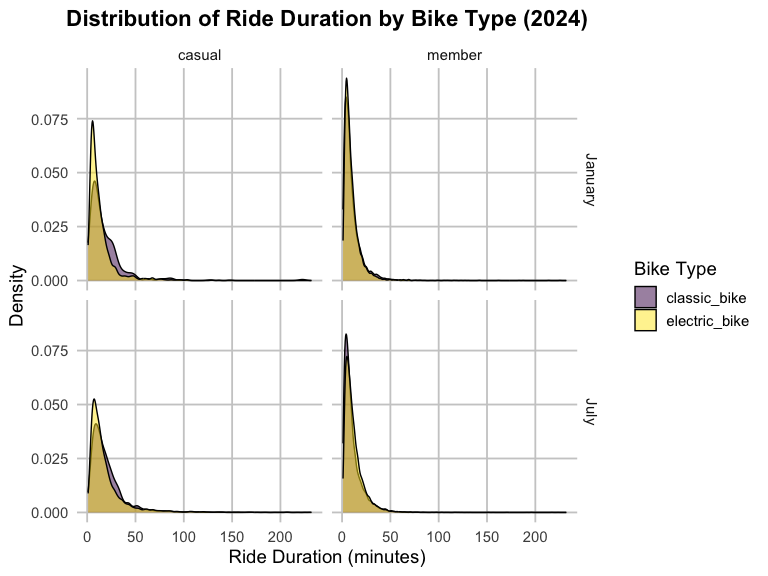

p8105_hw3_yc4588
================
Yining Cao
2024-10-12

- [Load necessary packages](#load-necessary-packages)
- [Prolem 1](#prolem-1)
  - [Import the dataset](#import-the-dataset)
  - [Clean the data](#clean-the-data)
  - [Two-panel plot showing the average max temperature in January and
    in July in each station across
    years](#two-panel-plot-showing-the-average-max-temperature-in-january-and-in-july-in-each-station-across-years)
  - [Two-panel plot showing (i) tmax vs. time for the full dataset
    and (ii) the distribution of snowfall values greater than 0 and less
    than 100 separately by
    year](#two-panel-plot-showing-i-tmax-vs-time-for-the-full-dataset-and-ii-the-distribution-of-snowfall-values-greater-than-0-and-less-than-100-separately-by-year)
- [Problem 2](#problem-2)
  - [Import and clean the participants’ demographic and their
    accelerometer
    data](#import-and-clean-the-participants-demographic-and-their-accelerometer-data)
  - [Merge the two datasets](#merge-the-two-datasets)
  - [Create table for the number of men and women in each education
    category](#create-table-for-the-number-of-men-and-women-in-each-education-category)
  - [Create a plot of the age distributions for men and women in each
    education
    category](#create-a-plot-of-the-age-distributions-for-men-and-women-in-each-education-category)
  - [Create a plot of total activity against age, separated by
    education](#create-a-plot-of-total-activity-against-age-separated-by-education)
  - [Create a three-panel plot that shows the 24-hour activity time
    courses for each education
    level](#create-a-three-panel-plot-that-shows-the-24-hour-activity-time-courses-for-each-education-level)
- [Problem 3](#problem-3)
  - [Import and clean citibike
    dataset](#import-and-clean-citibike-dataset)
  - [Create a table showing the total number of rides for each month and
    year, separated by member
    type](#create-a-table-showing-the-total-number-of-rides-for-each-month-and-year-separated-by-member-type)
  - [Create a table showing the 5 most popular starting stations for
    July
    2024](#create-a-table-showing-the-5-most-popular-starting-stations-for-july-2024)
  - [Create a plot to investigate the effects of day of the week, month,
    and year on median ride
    duration.](#create-a-plot-to-investigate-the-effects-of-day-of-the-week-month-and-year-on-median-ride-duration)
  - [Create a plot that shows the impact of month, membership status,
    and bike type on the distribution of ride
    duration](#create-a-plot-that-shows-the-impact-of-month-membership-status-and-bike-type-on-the-distribution-of-ride-duration)

# Load necessary packages

``` r
library(tidyverse)
```

    ## ── Attaching core tidyverse packages ──────────────────────── tidyverse 2.0.0 ──
    ## ✔ dplyr     1.1.4     ✔ readr     2.1.5
    ## ✔ forcats   1.0.0     ✔ stringr   1.5.1
    ## ✔ ggplot2   3.5.1     ✔ tibble    3.2.1
    ## ✔ lubridate 1.9.3     ✔ tidyr     1.3.1
    ## ✔ purrr     1.0.2     
    ## ── Conflicts ────────────────────────────────────────── tidyverse_conflicts() ──
    ## ✖ dplyr::filter() masks stats::filter()
    ## ✖ dplyr::lag()    masks stats::lag()
    ## ℹ Use the conflicted package (<http://conflicted.r-lib.org/>) to force all conflicts to become errors

``` r
library(ggridges)
library(patchwork)
library(p8105.datasets)
library(dplyr)
library(ggplot2)
```

# Prolem 1

## Import the dataset

``` r
data(ny_noaa)
```

## Clean the data

``` r
ny_noaa |> 
  count(snow) |>
  arrange(desc(n))
```

    ## # A tibble: 282 × 2
    ##     snow       n
    ##    <int>   <int>
    ##  1     0 2008508
    ##  2    NA  381221
    ##  3    25   31022
    ##  4    13   23095
    ##  5    51   18274
    ##  6    76   10173
    ##  7     8    9962
    ##  8     5    9748
    ##  9    38    9197
    ## 10     3    8790
    ## # ℹ 272 more rows

``` r
ny_noaa = 
  ny_noaa |>
  separate(date, into = c("year", "month", "day"), convert = TRUE) |>
  mutate(
    tmax = as.numeric(tmax),
    tmin = as.numeric(tmin))
```

- This dataset contains 2595176 rows and 9 columns. Variables include
  weather station id, date of observation, (tenths of mm), snowfall
  (mm), snow depth (mm), and min and max temperature (tenths of degrees
  C).
- 0 is the most commonly observed value for snowfall because most days
  of the year, it does not snow at all in NY.
- The second most commonly observed value is `NA`, indicating
  missingness.  
- Other common values are 13, 25, and 51, suggesting that snowfall is
  originally recorded in fractions of an inch and converted to mm.

## Two-panel plot showing the average max temperature in January and in July in each station across years

``` r
ny_noaa |> 
  group_by(id, year, month) |> 
  filter(month %in% c(1, 7)) |> 
  summarize(mean_tmax = mean(tmax, na.rm = TRUE, color = id)) |> 
  ggplot(aes(x = year, y = mean_tmax, group = id)) + geom_point() + geom_path() +
  facet_grid(~month) +
  labs(title = "Mean monthly temperature for each station across years for January and July")
```

    ## `summarise()` has grouped output by 'id', 'year'. You can override using the
    ## `.groups` argument.


- The temperature in July is generally higher than that in January. As
  expected, the mean temperature in January is much lower than the mean
  temperature in July for all stations and across all years. All
  stations appear to follow similar trends of temperature peaks and
  valleys within a month across the years, i.e. when one station has a
  high monthly mean temperature for a given year, most other stations
  also have a high monthly mean temperature for that year. We do see one
  uncharacteristically cold station in July of 1987 or 1988, as well as
  a few other less drastic outliers.

## Two-panel plot showing (i) tmax vs. time for the full dataset and (ii) the distribution of snowfall values greater than 0 and less than 100 separately by year

``` r
hex = 
  ny_noaa |> 
  ggplot(aes(x = tmin, y = tmax)) + 
  geom_hex()

ridge = 
  ny_noaa |> 
  filter(snow < 100, snow > 0) |>
  ggplot(aes(x = snow, y = as.factor(year))) + 
  geom_density_ridges()

hex + ridge
```

    ## Picking joint bandwidth of 3.76


- From the hex plot we see that while there is some variability, the
  majority of the data cluster tightly in the center of the
  distribution. In relatively rare cases, it seems that `tmax` is less
  than `tmin`, which raises questions about data recording and quality.
- From the ridge plot, we see a multimodal density of snowfall within a
  given year. Most stations see between 0 and 35 mm of snow in a year.
  Then there is a another group of stations that see about 45 mm of
  snow, and another group that sees nearly 80 mm. It is likely this
  multimodality stems from the conversion of measurements in one system
  (fractions of an inch) to another (using the metric system), which was
  also noted in the table of common values.

# Problem 2

## Import and clean the participants’ demographic and their accelerometer data

``` r
nhanes_accel = 
  read_csv("nhanes_accel.csv", na = c("NA", "", ".", " ")) |> 
  janitor::clean_names()
```

    ## Rows: 250 Columns: 1441
    ## ── Column specification ────────────────────────────────────────────────────────
    ## Delimiter: ","
    ## dbl (1441): SEQN, min1, min2, min3, min4, min5, min6, min7, min8, min9, min1...
    ## 
    ## ℹ Use `spec()` to retrieve the full column specification for this data.
    ## ℹ Specify the column types or set `show_col_types = FALSE` to quiet this message.

``` r
nhanes_covar = 
  read_csv("nhanes_covar.csv", na = c("NA", "", ".", " "), skip = 4) |> 
    janitor::clean_names() |>
  drop_na() |>
  mutate( education = as.character(education), 
          sex = as.character(sex)) |>
  mutate(
      education = case_match(
        education,
        "1" ~ "Less than high school",
        "2" ~ "High school equivalent",
        "3" ~ "More than high school"),
      sex = case_match(
        sex,
        "1" ~ "Male",
        "2" ~ "Female"
      ))
```

    ## Rows: 250 Columns: 5
    ## ── Column specification ────────────────────────────────────────────────────────
    ## Delimiter: ","
    ## dbl (5): SEQN, sex, age, BMI, education
    ## 
    ## ℹ Use `spec()` to retrieve the full column specification for this data.
    ## ℹ Specify the column types or set `show_col_types = FALSE` to quiet this message.

## Merge the two datasets

``` r
nhanes = 
  nhanes_accel |> 
  left_join(nhanes_covar, by = "seqn") |>
  filter(age >= 21) |>
  mutate(
    sex = factor(sex, levels = c("Male", "Female")),
    education = factor(education, levels = c(
      "Less than high school",
      "High school equivalent",
      "More than high school"
    ))) |>
  select(seqn, sex, age, bmi, education, everything())
```

- The merged dataset contains 228 rows and 1445 columns. Variables
  include seqn, sex, age, bmi, education, and accelerometer data.

## Create table for the number of men and women in each education category

``` r
education_gender_table <- nhanes |>
  group_by(education, sex) |>
  summarise(count = n()) |>
  pivot_wider(
    names_from = sex,
    values_from = count
  )
```

    ## `summarise()` has grouped output by 'education'. You can override using the
    ## `.groups` argument.

``` r
  knitr::kable(education_gender_table)
```

| education              | Male | Female |
|:-----------------------|-----:|-------:|
| Less than high school  |   27 |     28 |
| High school equivalent |   35 |     23 |
| More than high school  |   56 |     59 |

- The numbers of men (27) and women (28) are quite similar for the
  category of less than high school, indicating comparable
  representation among those who did not complete high school. More
  men (34) than women (23) have a high school equivalent education,
  suggesting that men are more likely to get high school education
  compared to women.There are slightly more women (59) than men (54) who
  have education beyond high school, indicating a trend where women may
  pursue higher levels of education more frequently than men
- Overall, the distribution suggests that while men and women are
  similarly represented at the lower end of educational attainment,
  women are more represented at higher education levels. This could
  reflect broader trends in gender differences in educational
  achievement.

## Create a plot of the age distributions for men and women in each education category

``` r
ggplot(nhanes, aes(x = factor(education), y = age, fill = factor(sex))) +
  geom_boxplot(outlier.shape = 21, outlier.fill = "red", outlier.size = 2, alpha = 0.7) +
  labs(title = "Age Distributions by Education and Sex",
       x = "Education Level",
       y = "Age",
       fill = "Sex") +
  scale_fill_manual(values = c("#6A5ACD", "#FFC1C1"), labels = c("Men", "Women")) +
  theme_minimal(base_size = 14) +
  theme(
    plot.title = element_text(hjust = 0.5, face = "bold"),
    axis.text.x = element_text(angle = 45, hjust = 1),
    panel.grid.major = element_line(color = "grey80"),
    panel.grid.minor = element_blank()
  ) +
  scale_x_discrete(labels = c("Less than High School", "High School Equivalent", "More than High School"))
```



- The median age is highest for both men and women in the “Less than
  High School” category, suggesting that older individuals are more
  likely to have lower educational attainment. In the “High School
  Equivalent” group, the median age decreases, but women have a higher
  median age than men, indicating that education was often prioritized
  more for women during this period. For those with education beyond
  high school, the median age is lowest for both genders, with women
  having a lower median age than men. This suggests significant progress
  in education for both men and women, although men attain higher
  education at an earlier age, this suggests a disparity in educational
  progress between the genders.

## Create a plot of total activity against age, separated by education

``` r
total_activity <- nhanes %>%
  mutate(total_activity = rowSums(select(., starts_with("min")), na.rm = TRUE)) %>%
  group_by(seqn, age, sex, education) %>%
  summarise(total_activity = sum(total_activity, na.rm = TRUE), .groups = "drop")

# Plot total activity against age, separated by education level and gender
ggplot(total_activity, aes(x = age, y = total_activity, color = factor(sex))) +
  geom_point(alpha = 0.6) +
  geom_smooth(method = "loess", se = FALSE) + # Add a smooth line
  facet_wrap(~ education) +
  labs(title = "Total Daily Activity vs. Age by Gender and Education Level",
       x = "Age",
       y = "Total Daily Activity (min)",
       color = "Gender") +
  scale_color_manual(values = c("#0000FF", "#FF6347"), labels = c("Men", "Women")) +
  theme_minimal(base_size = 14) +
  theme(
    plot.title = element_text(hjust = 0.5, face = "bold"),
    panel.grid.major = element_line(color = "grey80"),
    panel.grid.minor = element_blank()
  )
```

    ## `geom_smooth()` using formula = 'y ~ x'


- The plot shows that total daily activity decreases with age for three
  education levels.
- “Less than High School”: For individuals with less than a high school
  education, total daily activity for both men and women starts to
  decline around age 20. Between ages 50 and 60, men’s activity levels
  see a greater increase compared to women’s, but after age 60, activity
  levels decrease for both genders.
- “High School Equivalent”: Among men with a high school equivalent
  education, total daily activity increases slowly from age 20 to 40,
  decreases steadily from 40 to 60, and then remains relatively stable
  beyond 60. For women, activity levels rise to a peak between ages 20
  and 40, then decline between 40 and 60. After a brief increase between
  60 and 80, activity levels decrease again.
- “More than High School”: For men with more than a high school
  education, total daily activity declines between ages 20 and 40, rises
  from 40 to 50, and then gradually falls off. For women, activity
  remains relatively stable from 20 to 50, increases from 50 to 60, and
  then steadily declines.
- Overall, despite variations in total daily activity with all range of
  age, women with a high school education or higher tend to be more
  active than men across the age groups. This may suggest that
  educational attainment is associated with higher activity levels among
  women.

## Create a three-panel plot that shows the 24-hour activity time courses for each education level

``` r
nhanes_long <- nhanes |>
  pivot_longer(cols = starts_with("min"), 
               names_to = "minute", 
               values_to = "activity") |>
  mutate(minute = as.numeric(sub("min", "", minute))) 

activity_timecourse <- nhanes_long |>
  group_by(minute, sex, education) |>
  summarise(total_activity = sum(activity, na.rm = TRUE), .groups = "drop")

# Plotting the 24-hour activity time courses
ggplot(activity_timecourse, aes(x = minute, y = total_activity, color = factor(sex))) +
  geom_line(aes(group = sex), size = 1.2, alpha = 0.7) +
  geom_smooth(method = "loess", se = FALSE) +  # Add smooth lines for trends
  facet_wrap(~ education) +
  labs(title = "24-Hour Activity Time Courses by Education Level and Sex",
       x = "Minute of the Day",
       y = "Activity",
       color = "Sex") +
  scale_color_manual(values = c("#000080", "#FFB90F"), labels = c("Men", "Women")) +
  theme_minimal(base_size = 14) +
  theme(
    plot.title = element_text(hjust = 0.5, face = "bold"),
    panel.grid.major = element_line(color = "grey80"),
    panel.grid.minor = element_blank()
  )
```

    ## `geom_smooth()` using formula = 'y ~ x'


- The graph presents 24-hour activity patterns across three education
  levels—less than high school, high school equivalent, and more than
  high school—and distinguishes between men (blue) and women (yellow).
  The x-axis represents the minutes of the day, while the y-axis
  indicates activity levels. Across all groups, distinct peaks in
  activity are observed in the morning, midday, and evening, suggesting
  that these are periods of higher activity throughout the day. As the
  education level increases, the peaks in activity become more
  pronounced, indicating that individuals with higher education tend to
  have higher overall activity levels. Among those with less than a high
  school education and those with more than a high school education,
  women consistently show higher activity levels than men, particularly
  during peak times. This pattern may reflect differences in daily
  routines, occupational demands, or lifestyle behaviors between men and
  women. For the high school equivalent group, however, men exhibit
  higher activity levels than women, especially during midday peaks.
  This difference could indicate variations in the nature of physical
  activity associated with certain jobs or other daily tasks that men in
  this education group are more likely to engage in. Overall, the graph
  suggests that educational attainment and sex are both influential
  factors in daily activity patterns, with higher education generally
  linked to greater activity, and gender differences varying across
  educational levels.

# Problem 3

## Import and clean citibike dataset

``` r
jan_2020 = 
  read_csv("citibike/Jan 2020 Citi.csv", na = c("NA", "", ".", " ")) |>
  janitor::clean_names()
```

    ## Rows: 12420 Columns: 7
    ## ── Column specification ────────────────────────────────────────────────────────
    ## Delimiter: ","
    ## chr (6): ride_id, rideable_type, weekdays, start_station_name, end_station_n...
    ## dbl (1): duration
    ## 
    ## ℹ Use `spec()` to retrieve the full column specification for this data.
    ## ℹ Specify the column types or set `show_col_types = FALSE` to quiet this message.

``` r
jan_2024 = 
  read_csv("citibike/Jan 2024 Citi.csv", na = c("NA", "", ".", " ")) |>
  janitor::clean_names()
```

    ## Rows: 18861 Columns: 7
    ## ── Column specification ────────────────────────────────────────────────────────
    ## Delimiter: ","
    ## chr (6): ride_id, rideable_type, weekdays, start_station_name, end_station_n...
    ## dbl (1): duration
    ## 
    ## ℹ Use `spec()` to retrieve the full column specification for this data.
    ## ℹ Specify the column types or set `show_col_types = FALSE` to quiet this message.

``` r
july_2020 = 
  read_csv("citibike/July 2020 Citi.csv", na = c("NA", "", ".", " ")) |>
  janitor::clean_names()
```

    ## Rows: 21048 Columns: 7
    ## ── Column specification ────────────────────────────────────────────────────────
    ## Delimiter: ","
    ## chr (6): ride_id, rideable_type, weekdays, start_station_name, end_station_n...
    ## dbl (1): duration
    ## 
    ## ℹ Use `spec()` to retrieve the full column specification for this data.
    ## ℹ Specify the column types or set `show_col_types = FALSE` to quiet this message.

``` r
july_2024 =
  read_csv("citibike/July 2024 Citi.csv", na = c("NA", "", ".", " ")) |>
  janitor::clean_names()
```

    ## Rows: 47156 Columns: 7
    ## ── Column specification ────────────────────────────────────────────────────────
    ## Delimiter: ","
    ## chr (6): ride_id, rideable_type, weekdays, start_station_name, end_station_n...
    ## dbl (1): duration
    ## 
    ## ℹ Use `spec()` to retrieve the full column specification for this data.
    ## ℹ Specify the column types or set `show_col_types = FALSE` to quiet this message.

- The January 2020 dataset contains 12420 rows and 7 columns.
- The January 2024 dataset contains 18861 rows and 7 columns.
- The July 2020 dataset contains 21048 rows and 7 columns.
- The July 2024 dataset contains 47156 rows and 7 columns.
- Variables include ride id, rideable type, weekdays, duration, start
  station name, end station name and member casual.

## Create a table showing the total number of rides for each month and year, separated by member type

``` r
# merge the datasets
merged_data <- bind_rows(
  jan_2020 |>
    mutate(month = "January", year = 2020),
  jan_2024 |>
    mutate(month = "January", year = 2024),
  july_2020 |>
    mutate(month = "July", year = 2020),
  july_2024 |>
    mutate(month = "July", year = 2024)
)
ride_summary <- merged_data |>
  group_by(year, month, `member_casual`) |>
  summarise(total_rides = n(), .groups = "drop") |>
  arrange(year, month)

knitr::kable(ride_summary)
```

| year | month   | member_casual | total_rides |
|-----:|:--------|:--------------|------------:|
| 2020 | January | casual        |         984 |
| 2020 | January | member        |       11436 |
| 2020 | July    | casual        |        5637 |
| 2020 | July    | member        |       15411 |
| 2024 | January | casual        |        2108 |
| 2024 | January | member        |       16753 |
| 2024 | July    | casual        |       10894 |
| 2024 | July    | member        |       36262 |

- The table reveals a significant increase in Citi Bike usage from 2020
  to 2024 for both casual riders and members, with total rides rising
  notably over the years. For example, member rides grew from 11,436 in
  January 2020 to 16,753 in January 2024, while casual rides more than
  doubled from 984 to 2,108 in the same period. Seasonal patterns are
  evident, as July consistently shows higher ride counts compared to
  January, reflecting increased bike usage during warmer months. In
  2024, member rides in July reached 36,262, more than double the
  January figure. Although casual rides have grown substantially,
  especially in July (from 5,637 in 2020 to 10,894 in 2024), members
  consistently account for a higher number of rides, demonstrating
  stronger engagement with the bike-sharing program. Overall, the trends
  suggest a growing popularity of Citi Bikes, with increased
  participation across both casual and member categories, particularly
  during peak seasons.

## Create a table showing the 5 most popular starting stations for July 2024

``` r
popular_stations_july_2024 <- july_2024 |>
  group_by(`start_station_name`) |>
  summarize(num_rides = n(), .groups = "drop") |>
  arrange(desc(num_rides)) |>
  slice_head(n = 5)  # Get the top 5 stations

  knitr::kable(popular_stations_july_2024)
```

| start_station_name       | num_rides |
|:-------------------------|----------:|
| Pier 61 at Chelsea Piers |       163 |
| University Pl & E 14 St  |       155 |
| W 21 St & 6 Ave          |       152 |
| West St & Chambers St    |       150 |
| W 31 St & 7 Ave          |       146 |

## Create a plot to investigate the effects of day of the week, month, and year on median ride duration.

``` r
merged_data <- merged_data |>
  mutate(weekdays = factor(weekdays,
                           levels = c("Sunday", "Monday", "Tuesday", "Wednesday", "Thursday", "Friday", "Saturday")),
         month = factor(month, levels = c("January", "July")),
         year = as.factor(year))  # Convert year to a factor

# Calculate median ride duration by weekdays, month, and year
median_duration <- merged_data %>%
  group_by(weekdays, month, year) %>%
  summarize(median_duration = median(duration, na.rm = TRUE), .groups = "drop")

# Plotting the median ride duration
ggplot(median_duration, aes(x = weekdays, y = median_duration, fill = year)) +
  geom_bar(stat = "identity", position = "dodge") +
  facet_wrap(~ month) +
  labs(title = "Median Ride Duration Overview",
       x = "Day of the Week",
       y = "Median Ride Duration (minutes)",
       fill = "Year") +
  theme_minimal(base_size = 14) +
  theme(
    plot.title = element_text(hjust = 0.5, face = "bold"),
    axis.text.x = element_text(angle = 45, hjust = 1),
    panel.grid.major = element_line(color = "grey80"),
    panel.grid.minor = element_blank()
  )
```


- The bar chart presents a comparison of median ride duration (in
  minutes) across different days of the week in January and July, for
  the years 2020 (purple) and 2024 (yellow). In January, ride durations
  are relatively stable across the week for both years, with 2024
  showing slightly shorter durations compared to 2020. In July, however,
  the median ride durations are noticeably longer across all days
  compared to January, especially in 2020, where the durations
  significantly exceed those in 2024. The highest ride durations are
  observed on Saturdays in July for both years, indicating increased
  ride activity or different usage patterns during the summer weekends.

## Create a plot that shows the impact of month, membership status, and bike type on the distribution of ride duration

``` r
# Combine January and July 2024 datasets for analysis
  merged_2024_data <- bind_rows(
  jan_2024 |>
    mutate(month = "January"),
  july_2024 |>
    mutate(month = "July")
)

# density plot of ride duration by month, membership status, and bike type
ggplot(merged_2024_data, aes(x = duration, fill = `rideable_type`)) +
  geom_density(alpha = 0.5) +
  facet_grid(month ~ `member_casual`) +  # Facet by month and membership status
  labs(title = "Distribution of Ride Duration by Bike Type (2024)",
       x = "Ride Duration (minutes)",
       y = "Density",
       fill = "Bike Type") +
  theme_minimal(base_size = 14) +
  theme(
    plot.title = element_text(hjust = 0.5, face = "bold"),
    panel.grid.major = element_line(color = "grey80"),
    panel.grid.minor = element_blank()
  )
```



- The density plots illustrate the distribution of ride durations by
  bike type (classic and electric) for casual riders and members in
  January and July of 2024. Across all panels, the distributions are
  right-skewed, indicating that most rides are relatively short, with a
  few longer durations. Electric bikes (yellow) show a slightly higher
  density for shorter durations compared to classic bikes (purple),
  particularly for casual riders. This trend is consistent in both
  January and July. There is little noticeable difference in the shape
  of the distributions between the two months, suggesting that ride
  duration patterns are similar across seasons for both bike types and
  rider categories.
